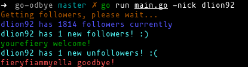

# go-odbye
Goodbye unfollowers!

A simple tool to check who [un]follow you on twitter.

## Usage
`./go-odbye -nick <yournick>`

## Example
`./go-odbye -nick dlion92`



## Option
`-nick <nick> Which user you want to track`   
`-url <true|false> If you want to see complete url`

## Config
To use this tool you need to add your consumer and token key/secret in a json config file on your `$HOME` dir called `.goodbye.json`, here the structure:   
```js
{
  "consumerKey": "<CONSUMER KEY>",
  "consumerSecret": "<CONSUMER SECRET>",
  "accessToken": "<ACCESS TOKEN>",
  "accessSecret": "<ACCESS SECRET>"
}
```

## Consumer/Token
You can obtain your consumer/token creating a new twitter application, see https://apps.twitter.com/ to more info.

## Author
Domenico Luciani aka DLion
https://domenicoluciani.com

## License
MIT
